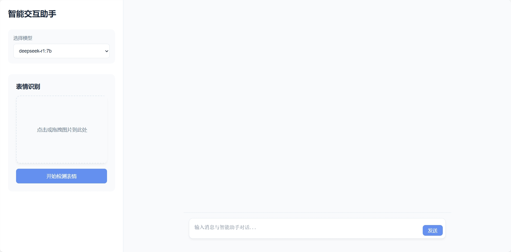

# 基于本地与云端大语言模型的表情识别智能对话系统

## 项目简介

本项目结合了 React 前端与 Flask 后端，实现了一个支持本地（Ollama）和云端（Deepseek）大语言模型的表情识别与智能对话系统。用户可上传表情图片进行识别，并与大模型进行智能对话，支持在网页端自由切换模型类型和 API Key。

---

## 功能特点

- 前后端分离，React + Flask 架构
- 支持本地表情图片上传与识别
- 支持 DeepFace 自动表情识别
- 支持 Ollama 本地大模型与 Deepseek 官方 API 云端大模型
- 网页端可自由切换模型类型（Ollama/Deepseek）
- Deepseek 支持网页端自定义 API Key
- 友好的网页交互界面

---

## 环境依赖

### 后端

- Python 3.7 及以上
- Flask
- Flask-CORS
- TensorFlow / Keras
- dlib
- deepface
- 其他依赖见 `requirements.txt`

### 前端

- Node.js（建议 16 及以上）
- npm
- 依赖见 `face-recognition-app/package.json`

---

## 快速开始

### 1. 启动后端服务（Flask）

```bash
pip install -r requirements.txt
python app.py
```

### 2. 启动前端服务（React）

```bash
cd face-recognition-app
npm install
npm start
```

### 3. 一键启动（可选）

直接双击根目录下的 `start_all.bat`，自动分别启动前后端。

---

## 使用方法

1. 打开浏览器访问前端页面（通常为 http://localhost:3000）。
2. 上传表情图片，系统将自动识别表情。
3. 在侧边栏选择模型类型（Ollama/Deepseek）和具体模型。
4. 若选择 Deepseek，可在网页输入你的 Deepseek API Key。
5. 在下方对话框输入内容，系统会结合识别到的表情和所选大模型生成相关回复。

---

## 项目结构

```
Emotions_LLM-main/
│
├── app.py                        # Flask 后端主程序
├── requirements.txt              # Python 依赖
├── start_all.bat                 # 一键启动脚本
├── shape_predictor_68_face_landmarks.dat # 人脸关键点检测模型
├── facial_expression_model_weights.h5    # 表情识别模型权重
├── images/
│   └── web.png                   # 网站界面截图
├── face-recognition-app/         # 前端 React 项目
│   ├── package.json
│   ├── src/
│   └── ...
└── README.md
```

---

## 网站界面



---

## 常见问题

- **Deepseek API Key 填写格式**：必须以 `sk-` 开头，且为官方提供的有效密钥。
- **DeepFace 权重下载失败**：请手动下载 `facial_expression_model_weights.h5` 并放到项目根目录或 `~/.deepface/weights/`。
- **模型切换异常**：请确保前端已切换到正确的 API 类型和模型名。

---
